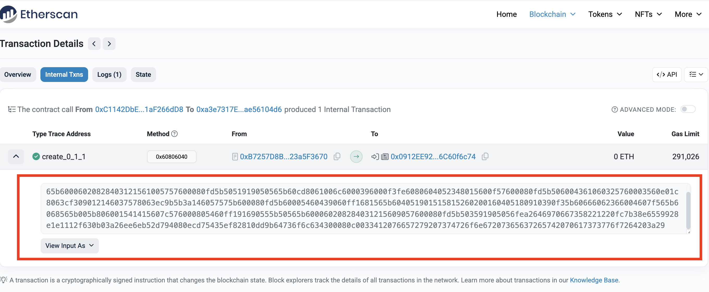

# EVM Constructor Decoder

Decode Solidity constructor arguments directly from contract creation bytecode.

Useful for:

- Smart contract auditing
- Reverse engineering deployed contracts
- CTFs
- On-chain security research
- Recovering constructor secrets

---

## Installation

From GitHub:

```bash
pip install "git+https://github.com/touchmeangel/evm_decode_constructor.git"
```

Docker:

```bash
docker pull touchmeangel/evm_decode_constructor
```

---

## Usage

CLI:

```bash
evm_decode_constructor "<creation_input>" "<constructor_types>"
```

Docker:

```bash
docker run --rm touchmeangel/evm_decode_constructor \
    "<creation_input>" \
    "<constructor_types>"
```

---

## Examples

Single parameter:

```bash
evm_decode_constructor "0x6080604052..." "bytes32"
```

Multiple parameters:

```bash
evm_decode_constructor "0x6080604052..." "address,uint256,bool"
```

---

## Example Output

```
======================================================================
DECODED CONSTRUCTOR ARGUMENTS
======================================================================
Parameter 1 (bytes32):
b'A very strong secret password :)'
======================================================================
```

---

## Getting the Creation Input

On Etherscan:

1. Open the contract.
2. Select the **Contract** tab.
3. Open **Contract Creation Code**.
4. Copy the complete creation input.



The copied creation input is the value passed to the decoder.

---

## Supported ABI Types

Examples include:

- address
- bool
- string
- bytes
- bytes32
- uint256
- int256
- address[]
- uint256[]
- tuples
- nested ABI-compatible types

---

## Notes

- The constructor types must exactly match the deployed constructor.
- Input must be the complete contract creation bytecode.
- Uses standard Solidity ABI decoding.

---

## License

Apache-2.0